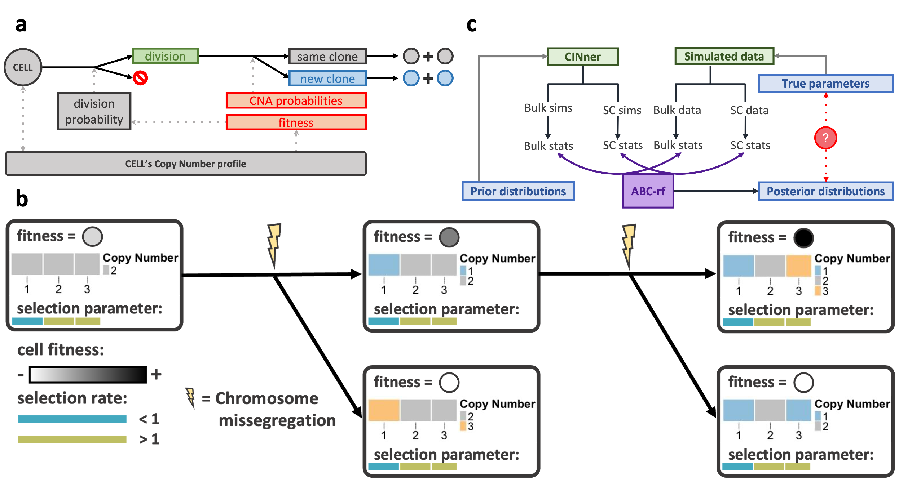
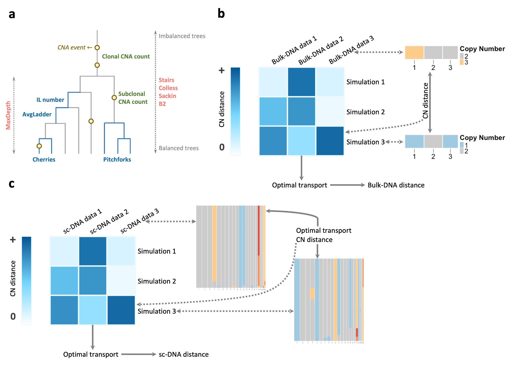
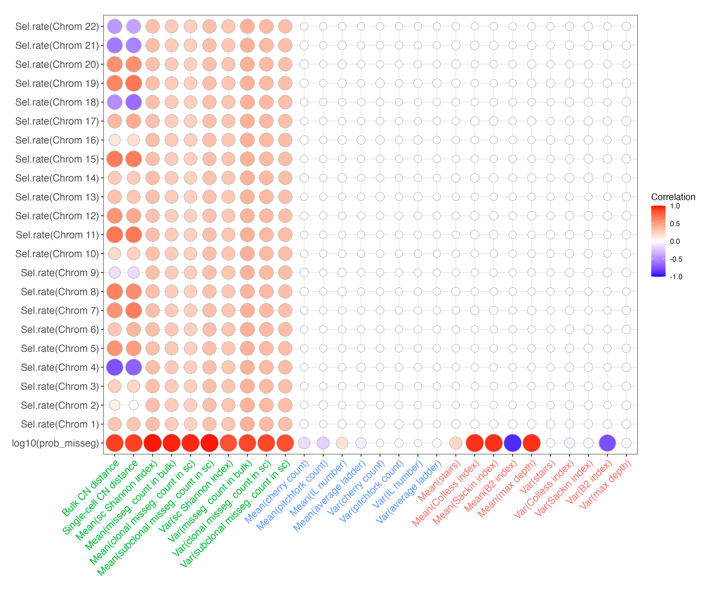
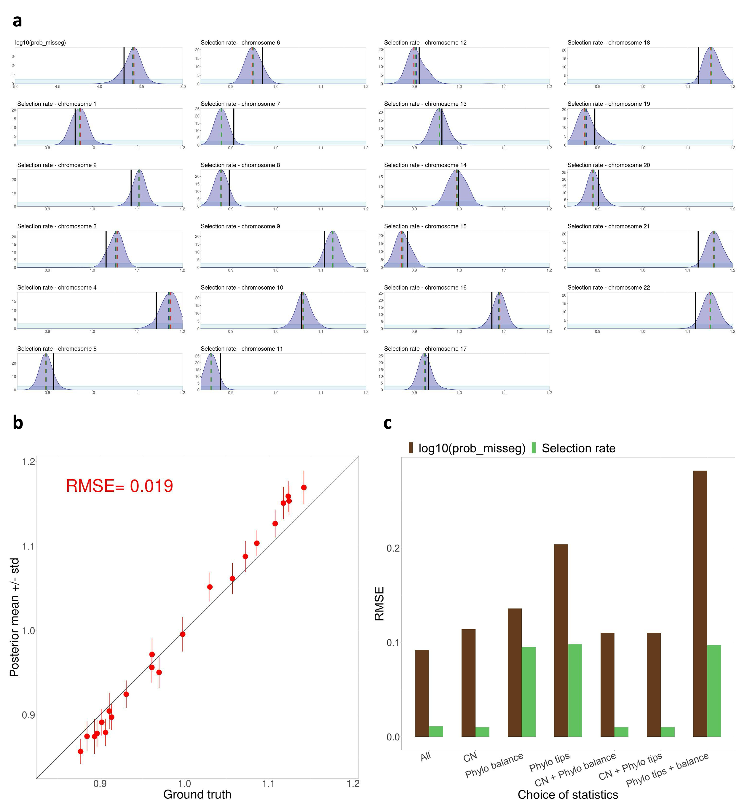
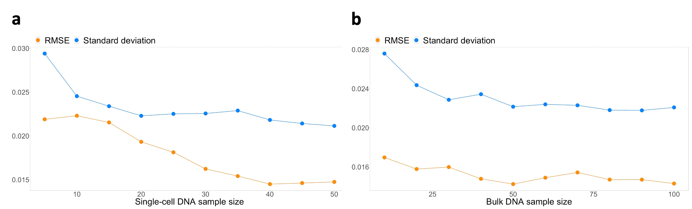
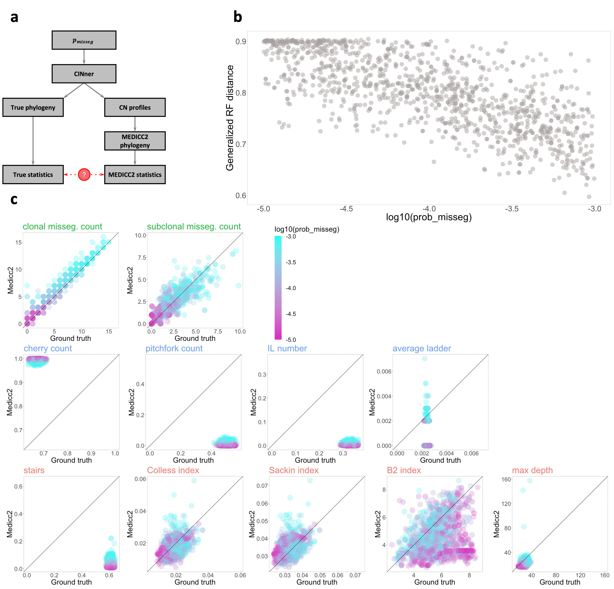

#   Inference of Chromosome Selection Parameters and Missegregation Rate in Cancer from DNA-Sequencing Data

##  Installation

The CINner simulator [1] can be installed with

```R
devtools::install_github("dinhngockhanh/CINner")
```

To perform CINner-based inference of chromosome selection parameters and missegregation rate in [2], the functions in the `R` folder must be loaded, then functions in the `vignettes` folder (detailed below) can be performed.

##  Result vignettes

Our inference method uses CINner to infer chromosome selection parameters and missegregation rate:


The file `vignettes/Inference for selection and missegregation parameters.r` reproduces results from our inference method for selection parameters and missegregation rate from a mixture of bulk and single-cell DNA sequencing data (Results sections 2 & 3, [2]):




The files `vignettes/Sensitivity of bulk DNA sample count.r` and `vignettes/Sensitivity of single-cell DNA sample count.r` reproduce our sensitivity studies to analyze the performance of the inference method with respect to the number of bulk and single-cell samples, respectively (Results section 4, [2]).


The file `vignettes/Study of MEDICC2 inference.r` studies the accuracy of single-cell statistics based on copy number profiles and phylogenies inferred by MEDICC2, compared to CINner ground-truth (Results section 5, [2]).


##  References
1.  Dinh KN, Vázquez-García I, Chan A, Malhotra R, Weiner A, McPherson AW, Tavaré S. CINner: modeling and simulation of chromosomal instability in cancer at single-cell resolution. bioRxiv. 2024.
2.  Xiang Z, Liu Z, Dinh KN. Inference of chromosome selection parameters and missegregation rate in cancer from DNA-sequencing data. bioRxiv. 2024.